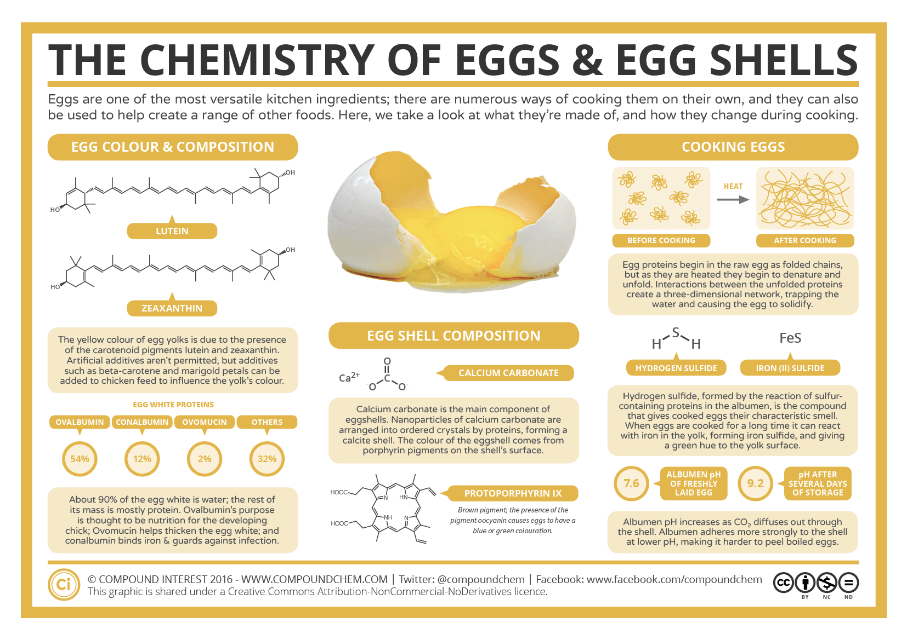

**What is broiler chicken?**

- Type of chicken that we usually eat is called ***broiler chicken***. Broiler chicken is a *category* of a chicken that specifically farmed for meat production.
- Broiler chicken typically slaughtered at 6-7 weeks of age.

**What kind of chicken they use for egg production?**

- A type of hen whose live purpose is for egg production, we call it Layer Breed chicken.
- For egg production, they usually use a different type of hen. In this video, this guy use [Lohmann Brown](https://www.youtube.com/watch?v=htuSdjX9U5g) chicken (Rhode Island), a specific type of custom breed.
- If layer chicken (ayam petelur) is becoming unproductive, it will be sold for consumption. Usually the texture of the meat a bit thicker than broiler chicken, a chicken that serve the purpose for consumption.

**Egg storage**

- Fresh egg has pH of 7.6 and will raise to pH 9.2 over the time due to the CO2 loss.
- Storing egg in the fridge can make the pH loss slower. Heat will make CO2 loss faster.
- Newly laid egg is harder to peel due to the inner shell binds tightly to the albumen protein. Store fresh egg in the fridge for one week will make it easier to peel.
- It's a tradeoff. Choose one: freshness or hard boiling performance.
- So thicker eggshell means we can store it longer because it has better defense mechanism.

**Why there is an egg that can hatch and doesn't hatch (for consume purpose)?**

- Two type of eggs: fertilized eggs and unfertilized.
- Unfertilized eggs are produced by hens without a rooster (male chicken). They can hatch eggs due to daylight.
- Fertilized eggs are produced with roosters. Rooster's sperm fertilizes the egg yolk.
- A hen can produce 250-300 eggs a year (unfertilized)
- Can I eat fertilized eggs? Yes
- Can broiler chicken produce eggs? Yes, but not well suited for hatching. They prioritize mass over egg production.
- Broiler chicken produce fertilized eggs, then moved to the incubator and it will hatch there.
- How chicken can lay egg with only daylight without rooster? They are sensitive to daylight length, triggering their hormones to produce egg.

**Difference between omega eggs and conventional eggs?**

- Difference in quality. [This guy](https://www.youtube.com/watch?v=nG1G-w5BuMM) explains they always do lab test for the chickens. Cholesterol far lower than conventional chicken.
- They use ISA brown and lohmann chicken.
- The reason they are difference is because of the diet. Omega chickens are fed by omega-rich food like flaxseed.
- The amount of protein, choline, selenium, vitamin A/B12 is the same. But more omega-6 and lower in omega-3 (which is worse).
- Omega eggs has more orange color due to richer content of omega-3
- Conventional egg has 25-50 mg of DHA compared to omega egg 100-225 mg of DHA.