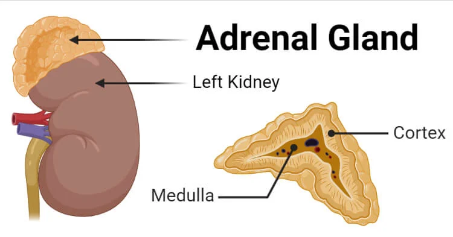

Cortisol is glucocorticoids. 

Gluco = glucose/sugar
Corti = made in the cortex (adrenal gland, above the kidney)
Coid = steroid structure

Adrenal gland:

Cortisol will make your brain "wake up" and feel more alert. It can command the liver to dump glucose to the bloodstream to provide instant energy for fight mode.

### How stress increases cortisol level

We call cortisol as the "stress hormone".

The hypothalamus detect threat, releases a hormone called ACTH (that regulates cortisol level) to the bloodstream. Our focus become narrower, our heart rate increases, blood sugar spikes, and your body is in fight or flight mode.

Cortisol job is to provide "instant energy" to survive, shuts down everything else. So it will be bad for the brain. It shrinks the brain. Constantly having high cortisol is **toxic** to hippocampus (for memory and spatial navigation), kills neurons and will make you having brain fog.