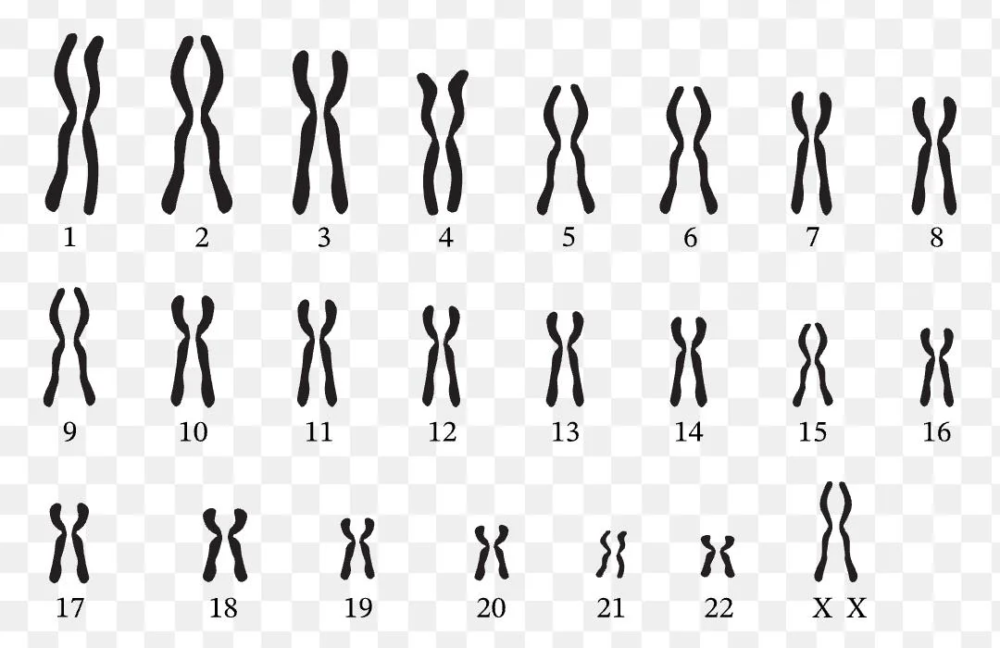

In a DNA, there are 23 pairs of chromosome, each of them has two chromosome (46 total). The 23rd chromosome determines sex (XX for female and XY for male). The rest of the chromosome is called autosome. Each chromosome carries genetics data.

Chromosomes are paired into two each, one from the father and one from the mother. It combines when the sperm meets the egg.

## How genes are inherited?

Genes carry data such as physical appearance: height, eye color, bone structure. If the parents are tall, high chance the child will be tall too, but there is a range and "limit" (e.g. 175cm - 185cm).

Intelligence are heritable too! But intelligence doesn't develop merely because the parents gene, it's a combination of environmental factors, nutrition, and education.

### Why diseases also inherited?

Diseases aren't inherited directly. It's the susceptibility that is inherited. Such as diabetes, it's highly genetic, because if you have a specific HLA genes in chromosome 6, the immune system is prone to mistake (wrongly attack cells).
