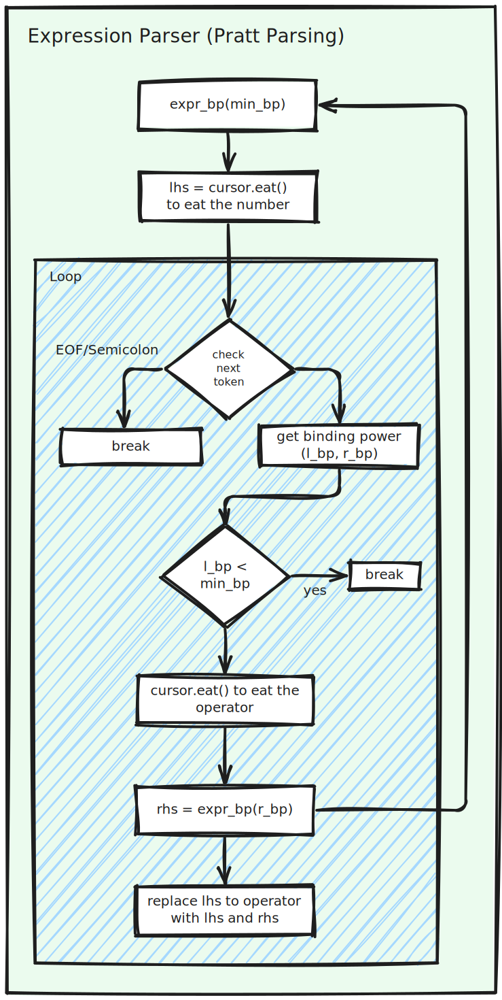
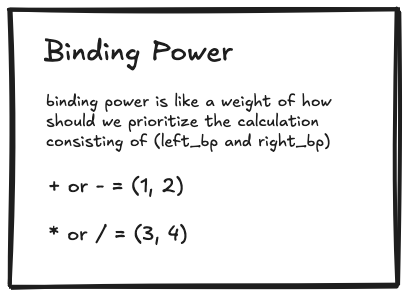

Prattausdruckparser ist eine Methode zum Parsen von Ausdrucken. Von einigen Tagen habe ich einen Artikel geschreiben, der ein Flussdiagram enhält, um den Parser zu erklären.



So funktioniert ist. Zunächst rufen wir eine Funktion `expr_bp` auf. In der Funktion haben wir das erste Token als `lhs` erhalten. `lhs` bedeutet "Left Hand Site" (linke Seite). Wir starten die Schleife. Haben wir ein nächste Token überprüfen. Wenn das nächste Token ist ein EOF oder Semikolon, brechen wir die Schleife.

Wir erhalten die linke BP (binding power) und rechte BP. Wir definieren die BP manuell.



Nehmen Sie dies als Beispiel:

```
1  +  2  *  3  /  4  -  5
  1  2  3  4  3  4  1  2
```

Wenn `l_bp` weniger als `min_bp` ist, es wird die Schleife beendet, aber wenn nicht, gehen wir zur nächsten Anzahl.

Wir erhalten die `rhs` durch rekursiven Aufruf der Funktion. Und wir ersetzen die `lhs` durch den Operator, der rekursiv auf `lhs` und `rhs` angewertet wird.

### Vocabulary bank

- `So funktioniert ist`: that is how it works
- `Flussdiagram`: flowchart
- `Ausdrucken`: parser
- `Zunächst`: first
- `die Schleife`: the loop
- `definieren`: define
- `ziehen`: move
- `angewertet wird`: is applied
- `auf`: to/on