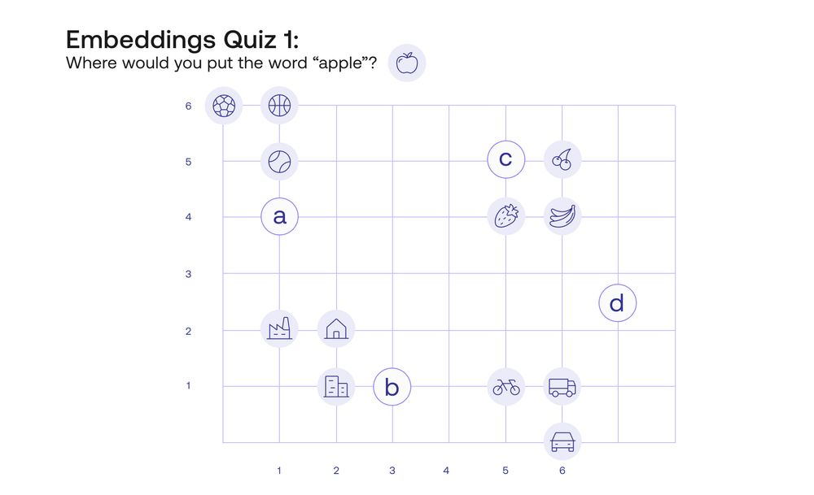
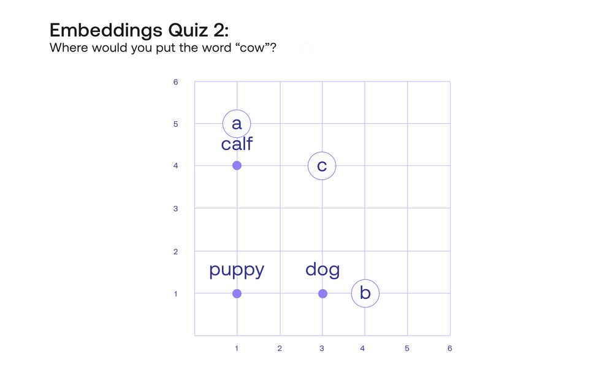
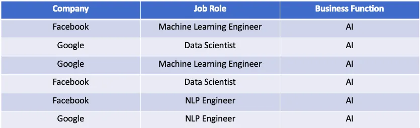

Sebelum masuk ke penjelasan embeddings, coba kita liat gambar di bawah dulu. Kira-kira dimana titik kita mau taro "apel"? Ya, pasti di titik C \[5,5\], karena pisang, stroberi, dan anggur itu di pikiran kita lebih dekat dengan apel, karena sama-sama buah.  
Sebuah kata akan ditempatkan di tempat yang kata lainnya mempunyai skor yang mirip.

Contohnya lagi di gambar kedua, dimana kira-kira kita akan taro kata "cow"?

Yap, kita taruh "Cow" di koordinat C. Kenapa? Kalau kita lihat patternnya, puppy (anak anjing) berada di koordinat `y` yang sama dengan dog (anjing), hanya berbeda posisi `x` nya saja. Perbedaan anak anjing dan anjing adalah umurnya. Kita bisa menyimpulkan bahwa koordinat x adalah usia, semakin ke kanan semakin bertambah usianya.

Maka, melihat pattern tersebut, kata "sapi" akan kita taro di koordinat C. Jadi itu kayak "sapi ke anak sapi itu sama seperti anjing ke anak anjing".

Lalu, kita bisa lihat koordinat `y` nya. Anjing mendapat angka satu sementara sapi mendapat angka empat. Secara sekilas, kita bisa menyimpulkan bahwa koordinat y ini menunjukkan ukuran besarnya tubuh hewan (semakin tinggi angkanya semakin besar badannya).

Sejauh ini, kita menempatkan sebuah kata pada koordinat dengan dua variabel atau sifat (contoh: umur dan besar). Text embeddings yang bagus itu tidak hanya mempunyai satu atau dua property, tapi banyak. Semakin banyak property, semakin banyak dimensi yang terbuat. 

Banyak LLM sekarang ini yang mempuyai banyak variabel, contohnya 4096. Koordinat di embedding ini disebut vector. Variabelnya banyak, contohnya umur, besar, warna, gender, dan ada juga campuran dari berbagai variable sampai manusia pun tidak mengerti.

Bagaimana property/variabel embedding didefine? Kok bisa dia bisa tau bahwa "cow" itu dekat dengan "calf"? Ya, karena beda mereka satu hewan tapi beda umur aja. Tapi bagaimana AI bisa tau kalo itu beda umur? Variabel "umur" itu didefine dari dataset-dataset yang diberikan. Contohnya, cek gambar dibawah ini:

Gambar di atas adalah dataset kecil yang diberikan ke program. Ketika ia masuk ke row pertama, Facebook dan Machine Learning Engineer itu diasosiasikan dengan AI. Ketika masuk ke row kedua, Google itu berhubungan dengan Data Scientist dan juga berhubungan dengan AI. Setelah itu, embedding dari Machine Learning Engineer akan menjadi lebih dekat dengan Data Scientist.

Kesimpulannya, text embeddings adalah representasi angka dari sebuah kata dalam bentuk vektor.

Dalam attention mechanism, embedding values ini akan diadjust ketika training.