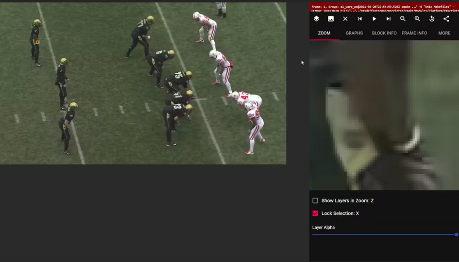
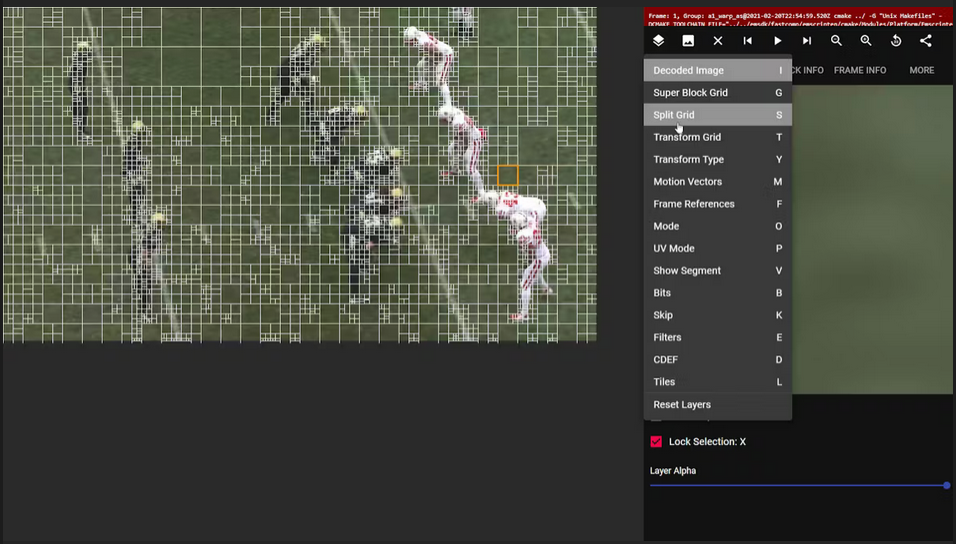
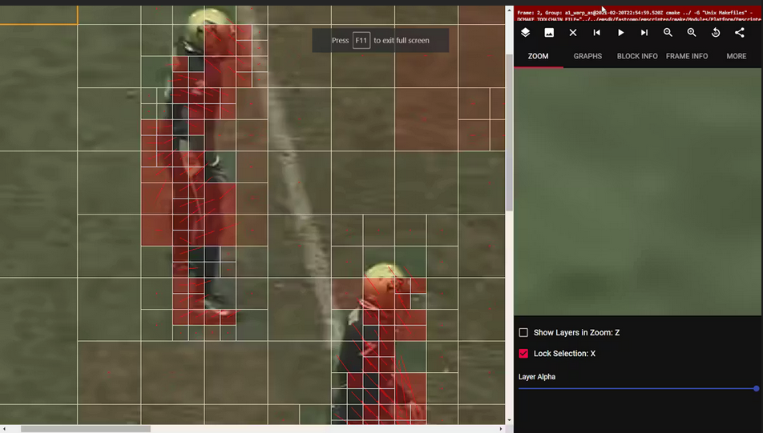

Video codecs itu adalah sebuah metode compression dan decompression untuk membuat sebuah video memiliki file size yang lebih kecil while maintaining its quality. Dengan menggunakan video codecs pasti akan ada quality loss (lossy compression).

### World without codecs 

Katakan codecs itu gak ada di dunia ini. Maka ukuran file video yang ada menjadi jauh lebih gede lagi. Bayangin ada satu video dengan spesifikasi seperti ini:

- durasi 30 detik
- 30 FPS
- ukuran 3840 x 2160 pixels (4K)
- bitrate 24 bits (RGB, 3 channel 8 bit each)

Jadi, file size video yang sebenarnya adalah:

```
= 30 * 30 * 3840 * 2160 * 24
= 179159040000 bits (179 gigabits)
= ~22 GB
```

### Using codecs

Dalam dunia computer science, banyak cara untuk mengoptimize hal ini. Contohnya, huffman coding itu ngecompress berdasarkan frequensi menjadi sebuah representasi bit.

Coba liat gambar di bawah ini:



Gambar di atas ada banyak redundansi pixel. Contohnya di bagian rumput, warna hijaunya itu repetitif di satu area tersebut. Jadi, setiap pixel yang repetitif itu bisa kita satukan menjadi satu "block" dengan metode *block partitioning*.

Dibawah ini adalah visualisasi block partitioning:



Pixel yang berulang digabung menjadi satu block. Sementara di bagian playernya itu punya detail yang lebih banyak, jadinya blocknya kecil-kecil.

Selanjutnya, jika sudah melakukan partitioning, kita melakukan motion prediction untuk membuat pergantian frame itu jadi lebih efisien. Daripada redraw keseluruhan frame dan menyimpan data seluruh pixel dari sebuah frame, kita hanya perlu ngetrack perubahan (motion) dari block-block yang ada.

Pada AV1 codecs ada yang namanya intra/inter prediction. Contoh inter prediction disini ngetrack pergerakan dari player dengan cara ngecompare frame sebelumnya dengan frame sekarang.



### Facts 

- AV1 itu adalah "next-gen" dari codecs2 yang ada sekarang seperti H264 dan H265, bisa ngecompress dengan file size yang lebih kecil namun kualitasnya sama.
- AV1 itu royalty-free, no license
- 30% streaming netflix itu menggunakan AV1 dari berbagai platform 

[source](https://hackernoon.com/how-video-compression-works-a-deep-dive-into-av1-8q3537fz)